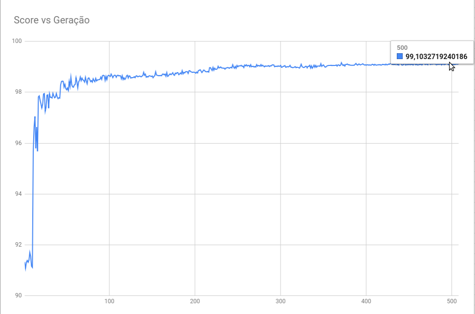

# Algoritmo Genético para o problema MountainCarContinuous-v0 (OpenAI Gym)

**Aluno:** Rafael Telles
**RA:** 11036114

## Descrição oficial do problema

> A car is on a one-dimensional track, positioned between two "mountains". The goal is to drive up the mountain on the right; however, the car's engine is not strong enough to scale the mountain in a single pass. Therefore, the only way to succeed is to drive back and forth to build up momentum. Here, the reward is greater if you spend less energy to reach the goal.

> 

### Ambiente

* Posição do carrinho: um número real entre -0.6 e 1.2 (continuo)
* Velocidade do carrinho: um número real entre -0.07 e 0.07 (continuo)

### Ações

A única ação possível é aplicar uma força (de valor real entre -1 e 1) no carrinho, afim de movimentá-lo para frente ou para trás.

### Recompensa

Uma recompensa negativa é dada para cada ver que o motor é acionado, proporcional ao módulo da força.

Uma recompensa positiva de valor 100 é dada quando o carrinho chega no topo da montanha.

### Objetivo

O objetivo do agente é chegar no topo da montanha, minimizando o uso do motor do carrinho (valores aplicados como ação do carrinho). Logo, o agente deve atingir uma pontuação final bem próxima de 100.

---

## Solução

Decidi discretizar o ambiente e modelar o agente como um simples mapa(`dict` do Python), onde as chaves são uma tupla contendo os valores discretizados da posição e velocidade do carrinho, e o valor é o valor da força e ser exercída no carrinho (ação)

**Nota:** O mapa de cada agente terá `POSITION_GRANULARITY * VELOCITY_GRANULARITY` chaves.

### Discretização do ambiente

Para discretizar a variável X (posição ou velocidade do carrinho), pegamos o domínio de X e o dividimos em n partes iguais, no código `n` está definido como as constantes `POSITION_GRANULARITY` e `VELOCITY_GRANULARITY`.

Depois de muitas rodadas de testes, percebi que é melhor forçar que o valor discreto de X quando X = 0 seja único.

A normalização (discretização) é feita pela função `normalize`.

### Aplicação do Algoritmo Genético

#### Primeira geração

São criados `POPULATION_SIZE` agentes com valores aleatórios.

#### Passo

Todos os agentes existentes são testados e ordenados por performance. Apenas os `MAX_POPULATION_SIZE` melhores agentes são mantidos vivos para as próximas operações.

#### Breeding (Cruzamento)

Escolhe-se 2 agentes diferentes. Para cada chave presente no mapa dos agentes, escolha um número real entre 0 e 1, e combine o valor dos dois agentes para a mesma chave da segunte forma: `AgenteFilho[k] = a * Agente1[k] + (1 - a) * Agente2[k]`

Esse processo pode acontecer tem probabilidade `BREEDING_CHANCE` de acontecer.

#### Mutation (Mutação)

Para cada filho criado no passo de Breeding, há uma chance `MUTATION_CHANCE` de ocorrer uma mutação.
O filho original é mantido e um novo é criado a partir deste com apenas 1 dos valores alterado aleatoriamente.

---

## Resultados

A performance do algoritmo depende muito das constantes utilizadas, como a granularidade das variáveis e chances de mutação e cruzamento.

* O algoritmo conseguiu encontrar uma solução com pontuação maior que 98 com menos do que 50 iterações
* O algoritmo conseguiu encontrar uma boa solução, com pontuação maior do que 99.1 com aproximadamente 300 gerações.

