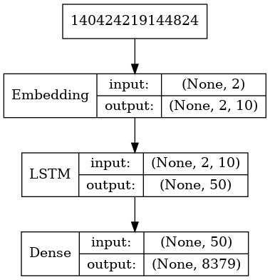
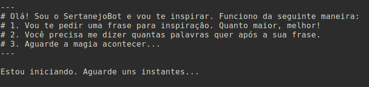
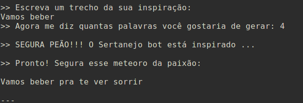
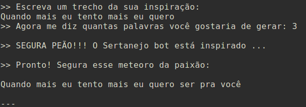
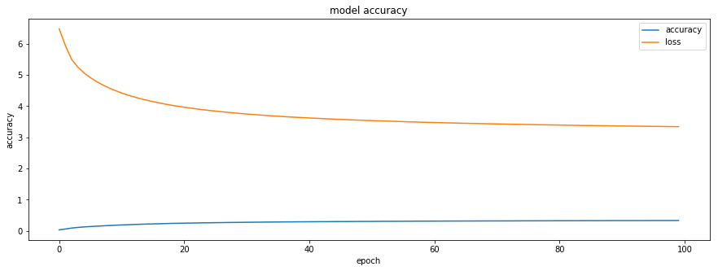

# SertanejoMachine

#### Adriano Shimonoe Moreno dos Santos - RA 11010111

Este é um bot que cria letras de músicas sertanejas baseada nas letras das músicas top 1000 do letras.mus.br.

---

### Como funciona

A implementação desse agente inteligente foi baseada em Redes Neurais Recurrentes. O princípio de funcionamento é bastante direto: O usuário insere um texto que serve como seed para a entrada do modelo, depois, uma sequência de palavras é sugerida na saída.

O Modelo foi criado utilizando o Python3 e o Keras.

---

### Como foi implementado

#### A obtenção de dados para o database

A base de dados para o projeto está na página do [letras.mus.br](https://www.letras.mus.br/mais-acessadas/sertanejo/), que disponibiliza um ranking de músicas mais acessadas no site, em formato de "Top 1000". O estilo de música Sertanejo foi o escolhido por possuir uma menor variação de vocabulário, o que facilita o processo de identificação de padrões pela rede neural mesmo que os interpretes das músicas sejam bem diferentes. A implementação do crawler utilizou alguns conceitos de processamento paralelo e requisições dos protocolos http baseadas nas bibliotecas da linguagem Python.

#### Preprocessamento da base

Para evitar que a rede neural artificial aprenda padrões incorretos através de ruídos, foram implementadas algumas funções que executam a limpeza e a padronização do texto. A primeira delas é a correção da codificação da página. Em alguns casos, foram encontradas algumas páginas com padrão de codificação diferente do UTF-8, resultando em palavras não identificáveis, tornando-as inutilizáveis. Neste caso, utilizei uma biblioteca chamada [ftfy](https://github.com/LuminosoInsight/python-ftfy), extremamente eficiente em identificar e substituir caracteres de diversas codificações em UNICODE. Outro ponto explorado está no contexto das sentenças. Como queremos produzir uma sequência de palavras que faça sentido, devemos inferir que sentenças como "Sou um cara apaixonado" possui o mesmo sentido de "sou um cara apaixonado". Portanto, trabalhar com sequências em caixa baixa é uma heurística aceitável para o problema.

#### A implementação da rede neural artificial

Utilizando as bibliotecas de processamento de texto do Keras, me baseando na implementação de exemplo disponibilizada no [git da biblioteca](https://github.com/keras-team/keras/blob/master/examples/lstm_text_generation.py) e no exemplo do [Nikolaev](https://towardsdatascience.com/generating-drake-rap-lyrics-using-language-models-and-lstms-8725d71b1b12),  criei uma Rede Neural Recorrente (RNR), mais adequada para o aprendizado de padrões de sequência. Primeiramente, a base de dados é transformada em uma corpora, que é tokenizada pelo utilitário do Keras e depois codificada em uma matriz esparsa. Esta matriz se baseia nos bigramas encontrados nas letras das música. As sequências que compõem a matriz são as entradas para a RNR, que é composta das seguintes camadas:

O treinamento foi realizado em uma instância p3.8xlarge da Amazon Web Services por 100 epochs.

---

### Como utilizar o gerador de letras

Instale as bibliotecas requeridas para a execução utilizando o comando abaixo na raíz do programa:

1. Para criar um ambiente virtual para o Python

`python3 -m venv env`

2. Para ativar o ambiente virtual

`source env/bin/activate`

3. Para instalar as dependências do programa

`pip install -r requirements.txt`

4. Para executar o script que gera as letras

`python gerador_de_perodas_do_cerrado.py`

Siga as instruções que serão exibidas no console e divirta-se :)

#### Algumas telas capturadas do SertanejoMachine em ação

### Considerações finais

O modelo treinado possui algumas deficiências. Primeiro porque o modelo gerado utilizou uma estratégia de separação das sequências baseadas em bigramas. Isso faz com que parte da informação semântica seja perdida no processo de tokenização e criação da matriz esparsa.  Outro ponto a ser considerado é o de que a base de treino é muito pequena, com apenas 1000 exemplos. Este fato faz com que seja mais difícil para a rede aprender sobre os padrões pois não existem exemplos suficientes para gerar os pesos adequados nas camadas ocultas da RNR. Abaixo um gráfico gerado a partir do modelo treinado (disponível no notebook de treinamento do modelo).

Podemos observar claramente que o modelo não converge para uma acurácia maior do que a observada. Nos testes de validação por epoch, o valor máximo obtido foi de 33,74%.

#### Possíveis melhorias

1. Melhoria no crawler para a captura de mais exemplos;

2. A divisão em n-gramas mais próximo da média por sentença;

3. O aumento do número máximo de palavras por sentença para a entrada do modelo;

4. O treino realizado em mais de 100 epochs.

